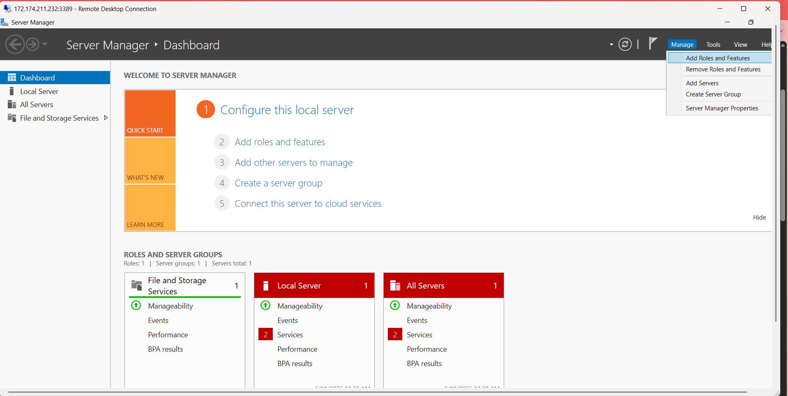
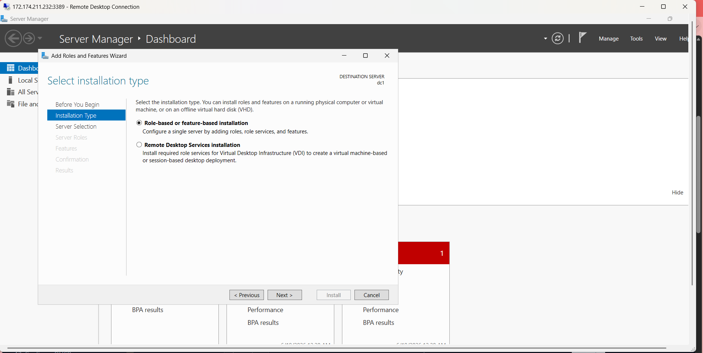
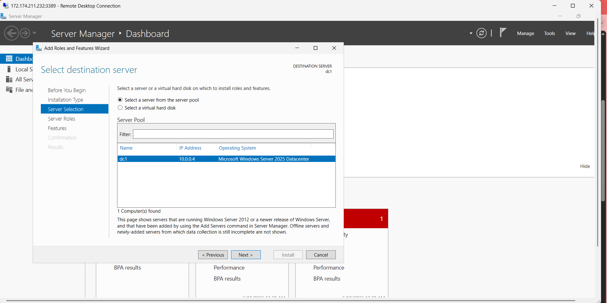
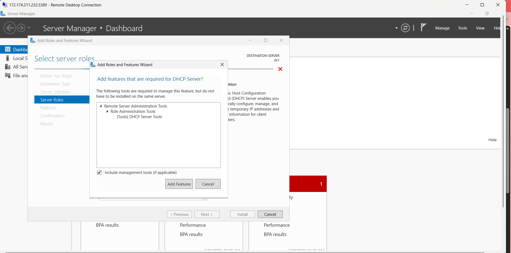
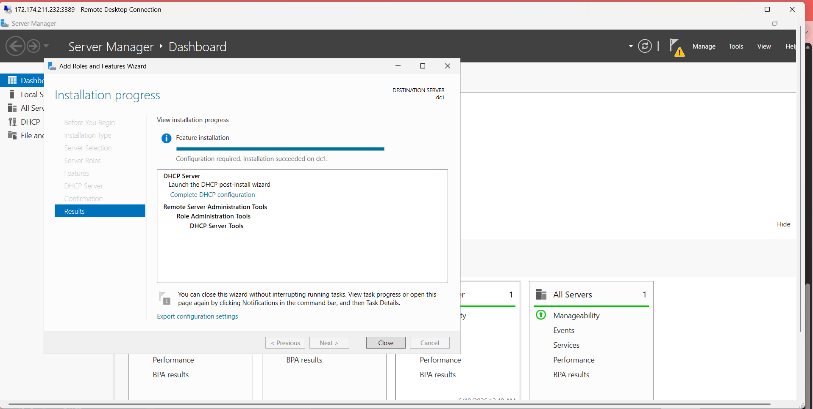
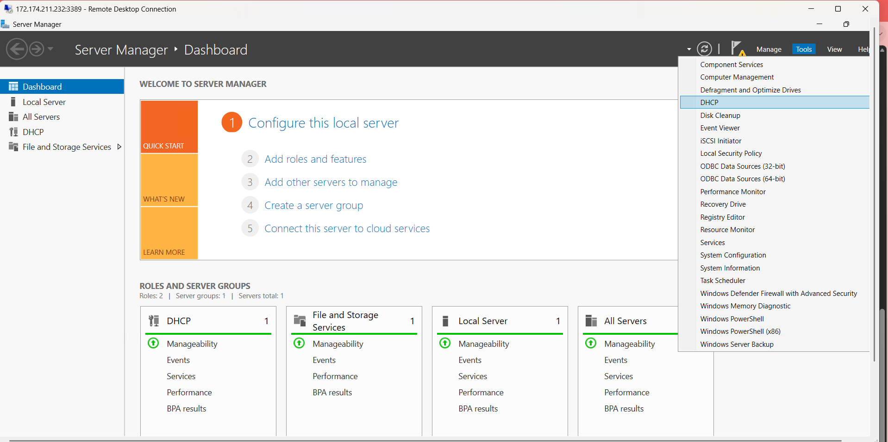

# DHCP-Configuration
<h1>DHCP Scope Setup on Windows Server</h1>

<h2>Description</h2>

<b>In this project, I set up and configure DHCP on a Windows Server to automatically manage IP addressing in a virtual network. I install the DHCP Server role, authorize it in Active Directory, create and configure a DHCP scope, and verify that clients receive valid IP leases.<b/>

 
 

<h3>Step 1: Install DHCP Role</h3>

  I start by opening Server Manager and launching the Add Roles and Features wizard. From there, I choose a role‑based installation, select dc1 from the server pool, and enable the DHCP Server role, including the required management tools . After confirming the selections, I complete the installation and verify success by checking that DHCP now appears under the Tools menu in Server Manager

 

  
  
  
  
  
  

 

<h3>Step 2: Configure DHCP</h3>
